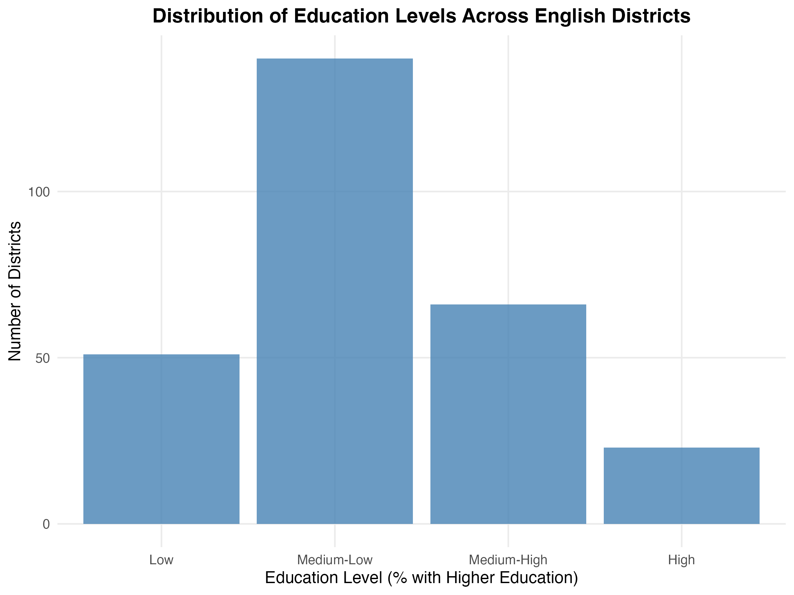
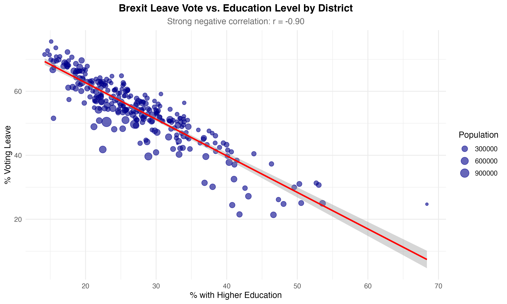

# Brexit Voting Behavior: Education and District-Level Analysis

**A statistical analysis of the relationship between education levels and Brexit voting patterns using district-level referendum data**

[](https://www.r-project.org/)
[](https://www.tidyverse.org/)

## 📊 Project Overview

This project analyzes voting behavior in the 2016 Brexit referendum, investigating the relationship between education levels and voting preferences. Using district-level data from England and survey data covering the entire UK, the analysis reveals strong statistical associations between educational attainment and referendum outcomes.

**Key Finding:** Districts with higher percentages of university-educated residents showed significantly lower support for leaving the EU (correlation: -0.90, p < 0.001).

## 🎯 Research Question

*How did education levels influence Brexit voting behavior, and what patterns emerge when analyzing district-level demographics?*

## 📁 Project Structure

```
brexit-voting-analysis/
├── README.md                  # This file
├── analysis.R                 # Main analysis script
├── data/
│   └── eng_districts.csv     # District population data
└── visualizations/
    ├── education_distribution.png
    ├── leave_vs_education.png
    └── correlation_matrix.png
```

## 🔍 Methodology

### Data Sources
- **Survey Data**: Individual-level voting intentions (n=30,895)
- **District Data**: Aggregated referendum results for 382 districts
- **Population Data**: District-level demographic information for England

### Statistical Methods
- **Chi-square tests** for independence between categorical variables
- **Correlation analysis** (Pearson) for continuous relationships
- **Data manipulation** using tidyverse principles
- **Visualization** with ggplot2

### Key Variables
- `vote`: Voting intention (leave/stay/don't know/won't vote)
- `education`: Education level (1-5 scale)
- `high_education`: Percentage of residents with higher education
- `leave`: Percentage voting to leave EU
- `age`: Respondent age
- `Population`: District population

## 📈 Key Findings

### 1. Strong Education-Vote Relationship
- **Chi-square statistic**: 2109 (df=12, p < 0.001)
- Education level and voting choice are **not independent**
- Lower education levels associated with higher leave support

### 2. District-Level Patterns
- **Correlation (Leave vs. High Education)**: -0.90 (p < 10⁻¹⁰²)
- **Correlation (Leave vs. Population)**: -0.20 (p = 0.0009)
- **Correlation (High Education vs. Population)**: 0.002 (p = 0.98, not significant)

### 3. Demographic Insights
- **Among lowest education level**: 66.3% voted leave
- **Among highest education level**: Significantly more likely to vote remain
- **Average age by vote**:
  - Leave voters: 55.3 years
  - Remain voters: 47.2 years
  - Won't vote: 40.2 years

### 4. Survey Prediction Accuracy
- **Poll estimate**: 47.3% remain
- **Actual England result**: 53.4% leave
- Poll underestimated leave support by ~6 percentage points

## 🛠️ Technical Implementation

### R Packages Used
```r
library(tidyverse)  # Data manipulation and visualization
library(dplyr)      # Data wrangling
library(ggplot2)    # Visualizations
library(Hmisc)      # Statistical functions
library(corrr)      # Correlation analysis
```

### Key Code Snippets

**Chi-square test for independence:**
```r
chi_square_test <- chisq.test(table(brexit_data$vote, brexit_data$education))
```

**Correlation analysis with significance:**
```r
cor_matrix <- brexit_data_district %>%
  select(leave, high_education, Population) %>%
  cor(use = "complete.obs")
```

**Data merging and transformation:**
```r
brexit_data_district <- brexit_data_district %>%
  inner_join(pop_en, by = c("name" = "District")) %>%
  mutate(prop_pop = Population / sum(Population))
```

## 📊 Visualizations

### Education Distribution Across Districts

*Bar chart showing the distribution of education levels across English districts*

### Leave Vote vs. High Education

*Scatter plot demonstrating the strong negative correlation between education and leave voting*

### Correlation Matrix

*Heatmap of correlations between leave percentage, education, and population*

## 💡 Interpretation & Implications

### Political Economy Insights
The strong negative correlation between education and Brexit support reveals important patterns about how educational attainment relates to attitudes toward European integration. Several factors may explain this:

1. **Economic exposure**: Higher education often correlates with employment in sectors more integrated with EU markets
2. **Mobility and identity**: University-educated individuals may have more international connections and cosmopolitan identities
3. **Information processing**: Education may influence how voters process complex policy information

### Geographic Patterns
The weak negative correlation between population size and leave voting suggests that urbanization alone doesn't explain voting patterns—rather, the *type* of urbanization (university towns vs. industrial cities) matters more.

### Methodological Notes
- Survey data had ~9% missing values on key variables, handled via listwise deletion
- District-level analysis limited to England to ensure data consistency
- Correlational analysis cannot establish causation—education may proxy for other socioeconomic factors

## 🔄 Reproducibility

### Requirements
- R version 4.0+
- Required packages: tidyverse, Hmisc, corrr

### Running the Analysis
```bash
# Clone repository
git clone https://github.com/yourusername/brexit-voting-analysis.git

# Open in RStudio or R
cd brexit-voting-analysis

# Run analysis
source("analysis.R")
```

### Data Access
- Survey data: Available from [Elena Llaudet's DSS GitHub repo](https://github.com/ellaudet/DSS)
- District data: Included in repository

## 📚 References

This analysis is based on research from:
- Hobolt, S. B. (2016). "The Brexit Vote: A Divided Nation, a Divided Continent"
- Becker, S. O., et al. (2017). "Who Voted for Brexit? A Comprehensive District-Level Analysis"

## 👨‍💻 About

**Author**: Tommaso Accornero  
**Program**: MSc Computational Social Science, Universidad Carlos III de Madrid  
**Course**: Data Programming  
**Date**: December 2025

**Connect with me:**
- LinkedIn: [linkedin.com/in/tommasoaccornero](https://linkedin.com/in/https://www.linkedin.com/in/tommaso-accornero-4084931a9/)
- Email: tommaso.accornero@outlook.com

## 📝 License

This project is available for educational and research purposes. Please cite appropriately if you use this analysis in your work.

---

*Analysis conducted as part of coursework in Data Programming at UC3M. All code and documentation created by Tommaso Accornero.*
